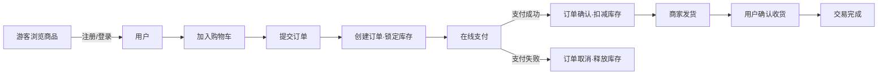
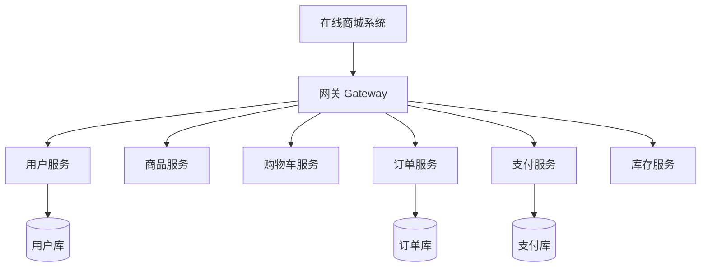

# microservices-practice-2412190221

《微服务开发与实践》课程个人练习仓库。**项目主题：在线商城系统（Online Mall）** —— 以一个典型的电商业务为载体，按课程进度逐步完成需求分析、单体实现、微服务拆分、测试与部署。

## 课程信息

- **课程名称**：微服务开发与实践
- **姓名**：金正宇
- **学号**：2412190221

## 项目简介

本项目规划一个**在线商城系统**，覆盖用户注册登录、商品浏览、购物车、下单、支付、订单管理、库存管理等核心电商场景。项目从单体应用起步，随课程进度按业务边界逐步拆分为多个微服务，作为课程全部实践作业的载体。

## 用户角色

| 角色 | 说明 | 核心权限 |
|------|------|----------|
| 游客（Guest） | 未登录访客 | 浏览商品、查看商品详情 |
| 普通用户（User） | 已注册买家 | 购物车、下单、支付、查看个人订单 |
| 商家（Merchant） | 商品提供方 | 商品上架/下架、库存维护、处理订单 |
| 管理员（Admin） | 平台运营方 | 用户管理、商品审核、订单仲裁、数据统计 |

## 功能模块

| 模块 | 职责说明 |
|------|----------|
| 用户服务 | 注册、登录、Token 鉴权、用户信息管理 |
| 商品服务 | 商品分类、商品信息、搜索、库存查询 |
| 购物车服务 | 购物车增删改查、结算快照 |
| 订单服务 | 下单、订单状态流转、订单查询 |
| 支付服务 | 支付单创建、支付回调、退款 |
| 库存服务 | 库存扣减/回滚、库存预警 |
| 网关与治理 | API 网关、服务注册发现、负载均衡、统一鉴权 |
| 管理后台 | 用户/商品/订单管理、运营数据看板 |

## 核心业务流程



## 功能结构（演进目标）



## 演进方向

| 阶段 | 目标 | 说明 |
|------|------|------|
| 阶段一：单体应用 | 跑通核心闭环 | 单一 Spring Boot 应用实现全部模块，优先验证业务逻辑 |
| 阶段二：模块拆分 | 按业务边界解耦 | 拆分用户/商品/订单/支付/库存为独立服务，引入服务注册发现 |
| 阶段三：微服务治理 | 完善基础设施 | 网关统一入口、配置中心、链路追踪、熔断限流 |
| 阶段四：容器化部署 | 可复现环境 | Docker 容器化 + Docker Compose 编排 + CI/CD |

> 采用"单体优先、按需拆分"的演进路线：先降低复杂度跑通业务，再在出现独立扩容、团队协作冲突等瓶颈时按业务边界拆分，风险可控、依据明确。

## 目录结构

```
.
├── README.md
├── docs/
│   └── homework/
│       ├── week-01/            # 开发环境与个人仓库
│       │   ├── index.md
│       │   └── screenshots/
│       └── week-02/            # Java 基础与项目规划
│           ├── index.md
│           └── screenshots/
└── src/                        # 项目源码（后续周次逐步填充）
```

## 环境信息

| 工具 | 版本 |
|------|------|
| Java | OpenJDK 21.0.6 LTS |
| Maven | 3.9.16 |
| Git | 2.52.0.windows.1 |
| Docker | 29.8.0（Docker Desktop） |
| Docker Compose | v5.5.1 |

> 每周作业详情见 [docs/homework/](docs/homework/) 对应目录。
