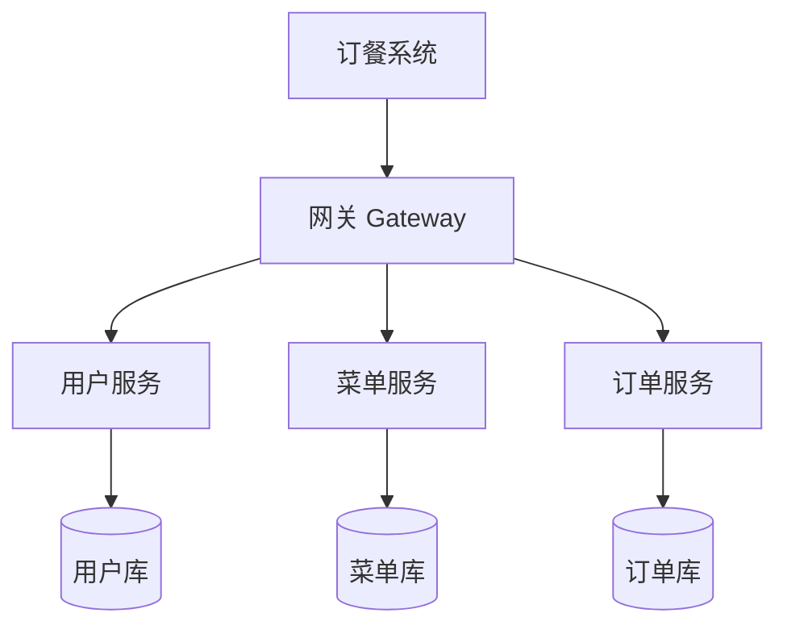

# microservices-practice-2412190221

《微服务开发与实践》课程个人练习仓库。**项目主题：订餐系统** —— 以"用户-菜单-订单"的点餐核心链路为载体，按课程进度完成需求分析、单体实现、微服务拆分、测试与部署。

## 课程信息

- **课程名称**：微服务开发与实践
- **姓名**：金正宇
- **学号**：2412190221

## 项目简介

一个简单的订餐系统，核心只有三个业务模块：**用户、餐厅菜单、订单**。从单体应用起步，后续按业务边界拆分为三个独立服务，作为课程实践作业的载体。

## 运行环境要求

| 工具 | 要求 |
|------|------|
| Java | OpenJDK 21（LTS）及以上 |
| Maven | 3.9 及以上 |

## 快速开始

```bash
# 1. 编译并运行测试
mvn test

# 2. 启动应用（两种方式任选）
mvn spring-boot:run
# 或先打包再运行：
mvn package
java -jar target/food-ordering-0.0.1-SNAPSHOT.jar
```

启动后应用监听 `http://localhost:8080`。

## 当前接口

| 接口 | 地址 | 说明 |
|------|------|------|
| 问候接口 | `GET http://localhost:8080/hello` | 返回欢迎问候语，验证服务可访问 |
| 健康检查 | `GET http://localhost:8080/actuator/health` | 返回 `{"status":"UP"}`，验证应用运行状态 |

## 尚未实现的业务能力

当前仅完成 Spring Boot 基础骨架与问候/健康检查接口，订餐业务能力**尚未实现**：

- 用户注册、登录与用户信息管理
- 菜单（菜品）列表、详情与商家维护
- 创建订单、订单列表与订单状态流转（接单/完成）

上述能力将在后续周次按模块逐步实现。

## 用户角色

| 角色 | 说明 |
|------|------|
| 顾客 | 注册登录、浏览菜单、下单、查看自己的订单 |
| 商家 | 维护菜单菜品、查看订单、接单/完成订单 |

## 功能模块

| 模块 | 职责 |
|------|------|
| 用户模块 | 注册、登录、用户信息管理 |
| 菜单模块 | 菜品列表、菜品详情、商家维护菜品 |
| 订单模块 | 创建订单、订单列表、订单状态更新（接单/完成） |

## 核心业务流程


## 功能结构



## 演进方向

| 阶段 | 目标 |
|------|------|
| 阶段一 | 单体应用，先跑通用户-菜单-订单闭环 |
| 阶段二 | 拆分为用户服务、菜单服务、订单服务三个微服务 |
| 阶段三 | Docker 容器化部署 |

> 先做单体降低复杂度，跑通业务后再按业务边界拆分，风险可控。

## 项目范围

**当前范围**：实现顾客注册登录、菜单浏览与维护、下单与订单状态流转（接单/完成）三个核心模块的单体版本。

**暂不实现**：支付对接、配送跟踪、优惠活动、评价体系、多门店管理。

## 后续可扩展方向

| 方向 | 说明 |
|------|------|
| 认证 | 引入 JWT/OAuth2 统一鉴权 |
| 服务拆分 | 按用户/菜单/订单边界拆分为独立微服务 |
| 消息 | 引入消息队列处理下单通知、订单状态事件 |
| 事务 | 分布式事务（订单与库存一致性） |
| 监控 | 链路追踪、日志聚合、指标监控 |
| 部署 | Docker 容器化 + Compose 编排 + CI/CD |

## 目录结构

```
.
├── README.md
├── pom.xml                       # Spring Boot 项目配置（Maven）
├── docs/
│   └── homework/
│       ├── week-01/              # 开发环境与个人仓库
│       │   ├── index.md
│       │   └── screenshots/
│       ├── week-02/              # Java 基础与项目规划
│       │   ├── index.md
│       │   └── screenshots/
│       └── week-03/              # Spring Boot 基础
│           └── index.md
└── src/
    ├── main/java/com/example/foodordering/   # 应用主类与控制器
    ├── main/resources/                        # 配置文件
    └── test/java/com/example/foodordering/    # 接口测试
```

## 环境信息

| 工具 | 版本 |
|------|------|
| Java | OpenJDK 21.0.6 LTS |
| Maven | 3.9.16 |
| Git | 2.52.0.windows.1 |
| Docker | 29.8.0（Docker Desktop） |
| Docker Compose | v5.5.1 |

> 每周作业详情见 [docs/homework/](docs/homework/) 对应目录。
