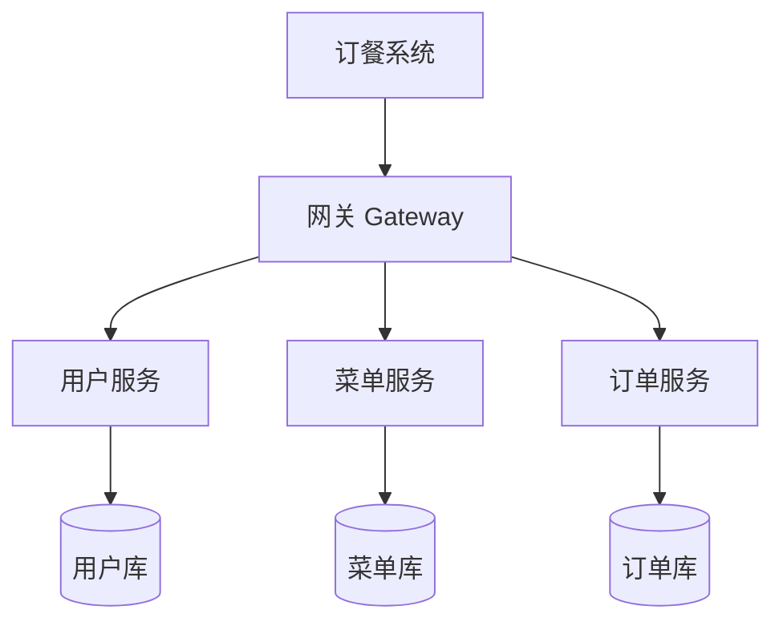

# microservices-practice-2412190221

《微服务开发与实践》课程个人练习仓库。**项目主题：订餐系统** —— 以"用户-菜单-订单"的点餐核心链路为载体，按课程进度完成需求分析、单体实现、微服务拆分、测试与部署。

## 课程信息

- **课程名称**：微服务开发与实践
- **姓名**：金正宇
- **学号**：2412190221

## 项目简介

一个简单的订餐系统，核心只有三个业务模块：**用户、餐厅菜单、订单**。从单体应用起步，后续按业务边界拆分为三个独立服务，作为课程实践作业的载体。

## 用户角色

| 角色 | 说明 |
|------|------|
| 顾客 | 注册登录、浏览菜单、下单、查看自己的订单 |
| 商家 | 维护菜单菜品、查看订单、接单/完成订单 |

## 功能模块

| 模块 | 职责 |
|------|------|
| 用户模块 | 注册、登录、用户信息管理 |
| 菜单模块 | 菜品列表、菜品详情、商家维护菜品 |
| 订单模块 | 创建订单、订单列表、订单状态更新（接单/完成） |

## 核心业务流程


## 功能结构



## 演进方向

| 阶段 | 目标 |
|------|------|
| 阶段一 | 单体应用，先跑通用户-菜单-订单闭环 |
| 阶段二 | 拆分为用户服务、菜单服务、订单服务三个微服务 |
| 阶段三 | Docker 容器化部署 |

> 先做单体降低复杂度，跑通业务后再按业务边界拆分，风险可控。

## 目录结构

```
.
├── README.md
├── docs/
│   └── homework/
│       ├── week-01/            # 开发环境与个人仓库
│       │   ├── index.md
│       │   └── screenshots/
│       └── week-02/            # Java 基础与项目规划
│           ├── index.md
│           └── screenshots/
└── src/                        # 项目源码（后续周次逐步填充）
```

## 环境信息

| 工具 | 版本 |
|------|------|
| Java | OpenJDK 21.0.6 LTS |
| Maven | 3.9.16 |
| Git | 2.52.0.windows.1 |
| Docker | 29.8.0（Docker Desktop） |
| Docker Compose | v5.5.1 |

> 每周作业详情见 [docs/homework/](docs/homework/) 对应目录。
